TRAINING MANAGEMENT SYSTEM

## Data Flow Diagram (DFD)

Professional Design Artifact
Split Views + Complete Overview + Mermaid Source

| Document Type | Data Flow Diagram |
| --- | --- |
| System | Training Management System |
| Technology Context | Node.js, Express.js, Bootstrap, MySQL |
| Presentation | 4 split logical views plus complete overview |
| Prepared Date | 6 October 2026 |

## 1. Purpose

This document presents the Training Management System Data Flow Diagram (DFD) in two complementary forms: four focused split views for readability in Microsoft Word, followed by the complete system overview. Each split view includes its Mermaid.js source and a rendered diagram.

## 2. Diagram Legend

| Element | Notation | Meaning |
| --- | --- | --- |
| External Entity | Rectangle | Person or external service that exchanges information with the system. |
| Process | Ellipse | Business/system function that transforms or handles data. |
| Data Store | Cylinder | Logical persistent data maintained by the application. |
| Data Flow | Directed arrow | Named information moving between entities, processes, and data stores. |

## 3.1 View A - Identity, Authentication and User Administration

Focused logical DFD view. The corresponding Mermaid.js source is provided on the following page.

Figure 3-1 - View A - Identity, Authentication and User Administration

#### 3.1.1 Mermaid.js Source - View A - Identity, Authentication and User Administration

Source definition for the preceding rendered DFD view.

| flowchart LR
    Participant[Participant]
    SystemAdmin[System Administrator]
    P1((P1 Account Management))
    P2((P2 Authentication & Access Control))
    P9((P9 User Administration))
    D1[(D1 Users)]
    D2[(D2 Participants)]
    D3[(D3 Roles & Access)]
    D9[(D9 Audit Records)]
 
    Participant -->|Account information| P1
    P1 -->|Create participant account| D1
    P1 -->|Create participant profile| D2
    P1 -->|Account creation outcome| Participant
    Participant -->|Login credentials| P2
    P2 -->|Validate user| D1
    P2 -->|Read role and access| D3
    P2 -->|Authentication outcome / session| Participant
    P2 -->|Authentication audit event| D9
    SystemAdmin -->|Administrative user maintenance| P9
    P9 -->|Create / maintain staff user| D1
    P9 -->|Assign role and access| D3
    P9 -->|User administration outcome| SystemAdmin
    P9 -->|User administration audit event| D9 |
| --- |

## 3.2 View B - Program Management and Participant Browsing

Focused logical DFD view. The corresponding Mermaid.js source is provided on the following page.

Figure 3-2 - View B - Program Management and Participant Browsing

#### 3.2.1 Mermaid.js Source - View B - Program Management and Participant Browsing

Source definition for the preceding rendered DFD view.

| flowchart LR
    Participant[Participant]
    TrainingAdmin[Training Administrator]
    P3((P3 Program Management))
    P4((P4 Program Browsing))
    D4[(D4 Program Categories)]
    D5[(D5 Training Programs)]
    D9[(D9 Audit Records)]
 
    TrainingAdmin -->|Program and category maintenance| P3
    P3 -->|Maintain categories| D4
    P3 -->|Maintain programs| D5
    P3 -->|Program administration outcome| TrainingAdmin
    P3 -->|Program administration audit event| D9
    Participant -->|Browse / view program request| P4
    D4 -->|Category information| P4
    D5 -->|Program details and availability| P4
    P4 -->|Program listing / details| Participant |
| --- |

## 3.3 View C - Registration, Cancellation and Notification

Focused logical DFD view. The corresponding Mermaid.js source is provided on the following page.

Figure 3-3 - View C - Registration, Cancellation and Notification

#### 3.3.1 Mermaid.js Source - View C - Registration, Cancellation and Notification

Source definition for the preceding rendered DFD view.

| flowchart LR
    Participant[Participant]
    TrainingAdmin[Training Administrator]
    EmailService[Email / Notification Service]
    P5((P5 Registration Management))
    P10((P10 Notification Processing))
    D2[(D2 Participants)]
    D5[(D5 Training Programs)]
    D6[(D6 Registrations)]
    D9[(D9 Audit Records)]
    D10[(D10 Notification Outbox)]
 
    Participant -->|Registration / cancellation request| P5
    D2 -->|Participant information| P5
    D5 -->|Program rules, schedule and capacity| P5
    D6 -->|Existing registration information| P5
    P5 -->|Create / cancel registration| D6
    P5 -->|Registration result| Participant
    TrainingAdmin -->|View registration request| P5
    P5 -->|Registration information| TrainingAdmin
    P5 -->|Registration audit event| D9
    P5 -->|Confirmation notification request| D10
    D10 -->|Pending notification| P10
    P10 -->|Registration confirmation email| EmailService
    EmailService -->|Delivery result| P10
    P10 -->|Update delivery status| D10
    P10 -->|Notification audit event| D9 |
| --- |

## 3.4 View D - Attendance, Certificate and Reporting

Focused logical DFD view. The corresponding Mermaid.js source is provided on the following page.

Figure 3-4 - View D - Attendance, Certificate and Reporting

#### 3.4.1 Mermaid.js Source - View D - Attendance, Certificate and Reporting

Source definition for the preceding rendered DFD view.

| flowchart LR
    Trainer[Trainer]
    TrainingAdmin[Training Administrator]
    P6((P6 Attendance Management))
    P7((P7 Certificate Management))
    P8((P8 Reporting))
    D1[(D1 Users)]
    D2[(D2 Participants)]
    D5[(D5 Training Programs)]
    D6[(D6 Registrations)]
    D7[(D7 Attendance)]
    D8[(D8 Certificates)]
    D9[(D9 Audit Records)]
 
    Trainer -->|Attendance entry| P6
    D6 -->|Registered participant list| P6
    P6 -->|Save attendance| D7
    P6 -->|Attendance result| Trainer
    P6 -->|Attendance audit event| D9
    TrainingAdmin -->|Certificate eligibility / issuance request| P7
    D6 -->|Registration information| P7
    D7 -->|Attendance information| P7
    P7 -->|Save certificate record| D8
    P7 -->|Certificate result| TrainingAdmin
    P7 -->|Certificate audit event| D9
    TrainingAdmin -->|Report request| P8
    D1 -->|Account information| P8
    D2 -->|Participant information| P8
    D5 -->|Program information| P8
    D6 -->|Registration information| P8
    D7 -->|Attendance information| P8
    D8 -->|Certificate information| P8
    P8 -->|Confirmed reports| TrainingAdmin
    P8 -->|Report audit event| D9 |
| --- |

## 4. Complete DFD Overview

The complete overview consolidates all four logical views into a single end-to-end data flow diagram. Use the split views above for detailed review and the overview below for overall system context.

Figure 4-1 - Complete Training Management System Data Flow Diagram

### 5. Complete Mermaid.js Source

The following Mermaid.js definition is the complete source representation for the consolidated DFD.

```mermaid
flowchart LR
    %% External Entities
    Participant[Participant]
    TrainingAdmin[Training Administrator]
    Trainer[Trainer]
    SystemAdmin[System Administrator]
    EmailService[Email / Notification Service]
 
    %% Processes
    P1((P1 Account Management))
    P2((P2 Authentication & Access Control))
    P3((P3 Program Management))
    P4((P4 Program Browsing))
    P5((P5 Registration Management))
    P6((P6 Attendance Management))
    P7((P7 Certificate Management))
    P8((P8 Reporting))
    P9((P9 User Administration))
    P10((P10 Notification Processing))
 
    %% Data Stores
    D1[(D1 Users)]
    D2[(D2 Participants)]
    D3[(D3 Roles & Access)]
    D4[(D4 Program Categories)]
    D5[(D5 Training Programs)]
    D6[(D6 Registrations)]
    D7[(D7 Attendance)]
    D8[(D8 Certificates)]
    D9[(D9 Audit Records)]
    D10[(D10 Notification Outbox)]
 
    %% Participant account and authentication
    Participant -->|Account information| P1
    P1 -->|Create participant account| D1
    P1 -->|Create participant profile| D2
    P1 -->|Account creation outcome| Participant
    Participant -->|Login credentials| P2
    P2 -->|Validate user| D1
    P2 -->|Read role and access| D3
    P2 -->|Authentication outcome / session| Participant
    P2 -->|Authentication audit event| D9
 
    %% Program administration and browsing
    TrainingAdmin -->|Program and category maintenance| P3
    P3 -->|Maintain categories| D4
    P3 -->|Maintain programs| D5
    P3 -->|Program administration outcome| TrainingAdmin
    P3 -->|Program administration audit event| D9
    Participant -->|Browse / view program request| P4
    D4 -->|Category information| P4
    D5 -->|Program details and availability| P4
    P4 -->|Program listing / details| Participant
 
    %% Registration and notification
    Participant -->|Registration / cancellation request| P5
    D2 -->|Participant information| P5
    D5 -->|Program rules, schedule and capacity| P5
    D6 -->|Existing registration information| P5
    P5 -->|Create / cancel registration| D6
    P5 -->|Registration result| Participant
    P5 -->|Registration audit event| D9
    P5 -->|Confirmation notification request| D10
    D10 -->|Pending notification| P10
    P10 -->|Registration confirmation email| EmailService
    EmailService -->|Delivery result| P10
    P10 -->|Update delivery status| D10
    P10 -->|Notification audit event| D9
 
    %% Registration administration
    TrainingAdmin -->|View registration request| P5
    D6 -->|Registration information| P5
    P5 -->|Registration information| TrainingAdmin
 
    %% Attendance
    Trainer -->|Attendance entry| P6
    D6 -->|Registered participant list| P6
    P6 -->|Save attendance| D7
    P6 -->|Attendance result| Trainer
    P6 -->|Attendance audit event| D9
 
    %% Certificate
    TrainingAdmin -->|Certificate eligibility / issuance request| P7
    D6 -->|Registration information| P7
    D7 -->|Attendance information| P7
    P7 -->|Save certificate record| D8
    P7 -->|Certificate result| TrainingAdmin
    P7 -->|Certificate audit event| D9
 
    %% Reporting
    TrainingAdmin -->|Report request| P8
    D1 -->|Account information| P8
    D2 -->|Participant information| P8
    D5 -->|Program information| P8
    D6 -->|Registration information| P8
    D7 -->|Attendance information| P8
    D8 -->|Certificate information| P8
    P8 -->|Student account / registration / certificate reports| TrainingAdmin
    P8 -->|Report audit event| D9
 
    %% Administrative user management
    SystemAdmin -->|Administrative user maintenance| P9
    P9 -->|Create / maintain staff user| D1
    P9 -->|Assign role and access| D3
    P9 -->|User administration outcome| SystemAdmin
    P9 -->|User administration audit event| D9
```

## 6. Design Notes

The split views do not change the logical design; they partition the same DFD by functional concern for document readability.

Participant registration is validated against participant, program, and existing registration information before a registration is created or cancelled.

Registration confirmation uses the Notification Outbox and Notification Processing flow so email delivery is decoupled from the committed registration transaction.

Audit events are captured for authentication and key business or administrative operations.

Reporting reads authoritative account, participant, program, registration, attendance, and certificate data.

## 7. Source Baseline

Prepared from the Training Management System Requirements Analysis v2.4 and Software Design Document v1.15, with the approved application context of Node.js, Express.js, Bootstrap, and MySQL.
