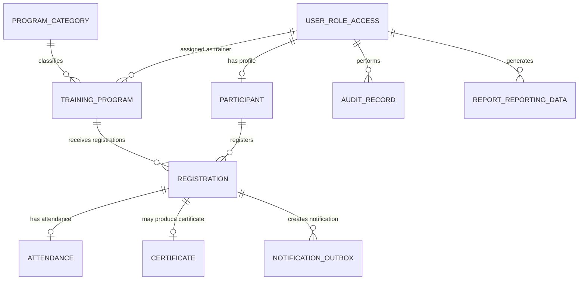
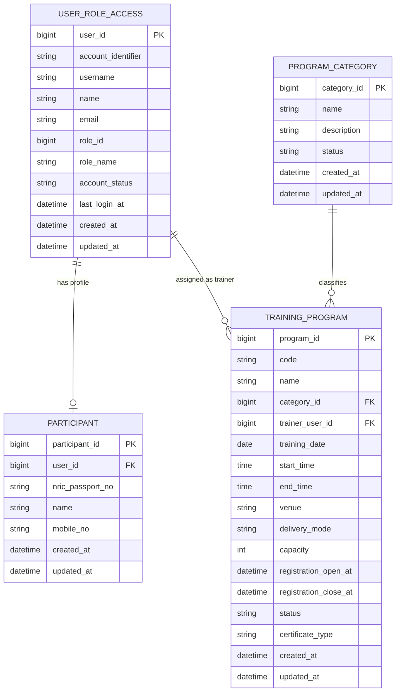
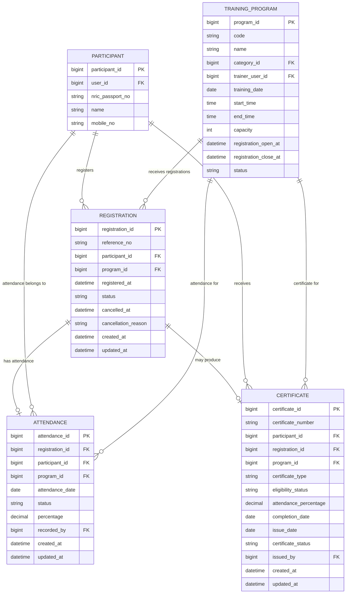
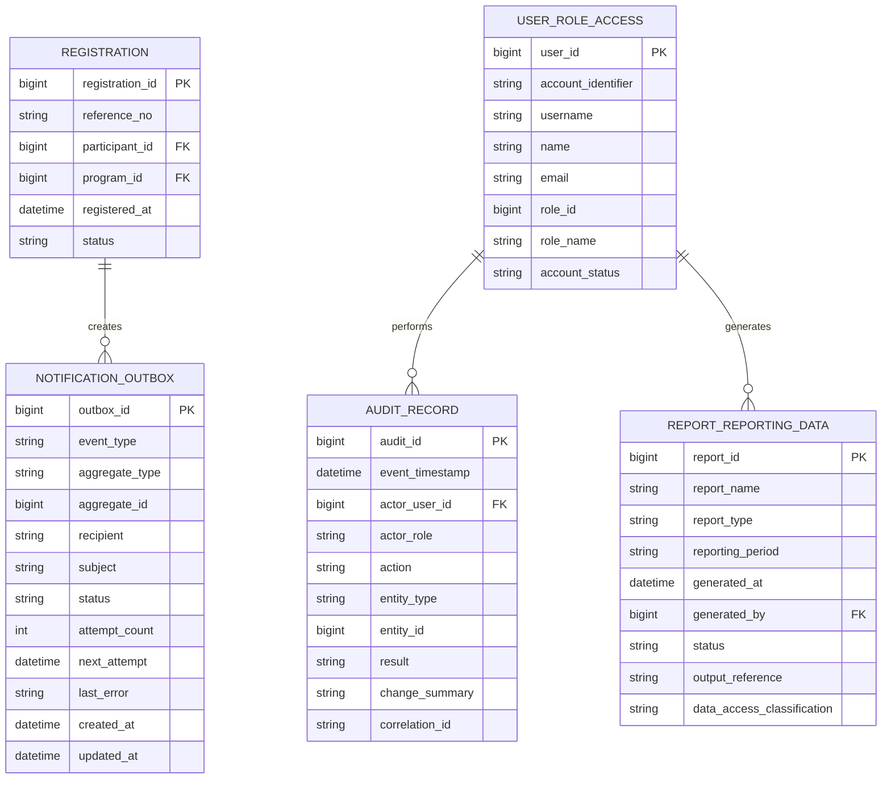

# TRAINING MANAGEMENT SYSTEM

## Entity Relationship Diagram (ERD)

Mermaid Source & Rendered Diagrams

| Document Type | Software Design Supporting Artifact |
| --- | --- |
| Version | 1.0 |
| Technology Context | Node.js / Express.js / Bootstrap / MySQL |
| Purpose | Maintainable ERD source and visual reference |

# 1. Document Purpose

This document provides the Training Management System logical Entity Relationship Diagrams together with the Mermaid source used to define each diagram. The source is retained as a version-controllable design artifact, while the rendered image provides a review-friendly visual representation.

# 2. Diagram Conventions

Primary keys are marked PK and foreign keys are marked FK. Mermaid crow's-foot cardinality is used: '||' means exactly one, 'o|' means zero or one, and 'o{' means zero or many. The diagrams are separated by domain to keep the model readable while preserving the approved logical relationships.

# 3. Logical ERD — Overview

## Mermaid Script

## Generated Diagram

Figure 4-1 — Logical ERD — Overview

# 4. Account & Program Management ERD

## Mermaid Script

## Generated Diagram

Figure 4-2 — Account & Program Management ERD

# 5. Registration Lifecycle ERD

## Mermaid Script

## Generated Diagram

Figure 4-3 — Registration Lifecycle ERD

# 6. Supporting & Governance ERD

## Mermaid Script

## Generated Diagram

Figure 4-4 — Supporting & Governance ERD

# 7. Implementation Notes

The Mermaid definitions should be maintained alongside the application source code so that data-model changes can be reviewed through normal version control. When a database change is approved, update the Mermaid source, regenerate the corresponding diagram, and update the Software Design Document in the same change set.

The ERD is a logical design artifact. Physical MySQL implementation details such as exact column lengths, indexes, constraints, engine settings, migration scripts and environment-specific configuration should remain aligned with the approved database design and implementation specifications.
